# Python Log Aggregation Pipeline

Generate and analyze CSV log files with multi-threading support.

## � Flow Diagram

```mermaid
flowchart LR
    subgraph Generate["1️⃣ Generate"]
        GEN[generate_csv_logs.py]
    end
    
    subgraph Storage["2️⃣ Storage"]
        CSV[(csv_logs/)]
    end
    
    subgraph Query["3️⃣ Query"]
        BASIC[myscript.py]
        OPT[myscript_optimized.py]
    end
    
    subgraph Output["4️⃣ Output"]
        RESULT[(results/)]
    end
    
    GEN -->|"Multi-thread"| CSV
    CSV --> BASIC
    CSV -->|"Parallel"| OPT
    BASIC --> RESULT
    OPT --> RESULT
```



## �📁 Structure

```
python/
├── generate_csv_logs.py    # Generate sample logs
├── myscript.py             # Basic query (single-thread)
├── myscript_optimized.py   # Fast query (multi-thread)
├── csv_logs/               # Log files
└── results/                # Query results
```

## � How to Run

```bash
cd python/
```

### 1. Generate Logs

```bash
python generate_csv_logs.py --days=90 --logs-per-day=50000 --threads=4
```

### 2. Query Logs

```bash
# Basic
python myscript.py --from_datetime="2025-01-01 00:00:00" --to_datetime="2025-01-31 23:59:59" --granularity=1day --dimensions=user

# Optimized (faster)
python myscript_optimized.py --from_datetime="2025-01-01 00:00:00" --to_datetime="2025-03-31 23:59:59" --granularity=1day --dimensions=user --threads=4
```

---

## 📋 Test Commands

```bash
# (1) dimensions: user,app
python myscript.py --from_datetime="2025-01-01 00:00:00" --to_datetime="2025-01-08 12:30:00" --user=user2 --granularity=30m --dimensions=user,app

# (2) dimensions: user
python myscript.py --from_datetime="2025-01-01 00:00:00" --to_datetime="2025-01-08 12:30:00" --user=user2 --granularity=30m --dimensions=user

# (3) dimensions: app
python myscript.py --from_datetime="2025-01-01 00:00:00" --to_datetime="2025-01-08 12:30:00" --user=user2 --granularity=30m --dimensions=app

# (4) multiple users
python myscript.py --from_datetime="2025-01-01 00:00:00" --to_datetime="2025-01-31 23:59:59" --user=user1,user2 --granularity=1day --dimensions=user

# (5) user + app filter
python myscript.py --from_datetime="2025-01-01 00:00:00" --to_datetime="2025-03-31 23:59:59" --user=user1,user2,user99 --app=facebook --granularity=1day --dimensions=user

# (6) optimized version
python myscript_optimized.py --from_datetime="2025-01-01 00:00:00" --to_datetime="2025-03-31 23:59:59" --user=user1,user2,user99 --app=facebook --granularity=1day --dimensions=user --threads=8
```

---

## � Terminal Output Examples

### Generate Logs Output

```
======================================================================
CSV LOG GENERATOR - Configuration
======================================================================
  Days to generate:    5
  Logs per day:        20,000
  Total logs:          100,000
  Worker threads:      4
======================================================================

Generating logs...
Progress: [████████████████████████████████████████] 100.0% (5/5) ETA: 0.00s

======================================================================
GENERATION COMPLETE
======================================================================
  Total files created: 5
  Total logs:          100,000

======================================================================
PERFORMANCE METRICS
======================================================================
Phase                          Time Total    Time Avg/Day   Throughput
----------------------------------------------------------------------
Log generation                      1.10s           0.22s    91,004 l/s
File writing                        0.31s           0.06s   323,046 l/s
----------------------------------------------------------------------
TOTAL                               1.41s           0.28s    70,978 l/s
======================================================================

CPU METRICS
----------------------------------------------------------------------
  CPU Model:           Intel(R) Core(TM) i5-8250U CPU @ 1.60GHz
  CPU Cores:           8 (using 4 threads)
  CPU Frequency:       2897 MHz (2.90 GHz)
  CPU Efficiency:      99.1%

MEMORY & I/O
----------------------------------------------------------------------
  Peak Memory:         31.97 MB
  I/O Write Ops:       14000
======================================================================
```

### Query Output (myscript_optimized.py)

```
======================================================================
SYSTEM INFORMATION
======================================================================
  CPU Model:      Intel(R) Core(TM) i5-8250U CPU @ 1.60GHz
  CPU Cores:      8
  CPU Frequency:  2900 MHz (2.90 GHz)
  Total Memory:   11.6 GB
======================================================================

Query: 2025-01-01 00:00:00 to 2025-03-31 23:59:59
Granularity: 1day | Dimensions: ['user']
Threads: 4
User filter: ['user1', 'user2', 'user99']
App filter: ['facebook']

Processing files...
Processed 71 files, 13,323 rows matched
Found 213 aggregated entries
Results saved to: results/result.csv

======================================================================
PERFORMANCE METRICS
======================================================================
Phase                                  Time        Rows/sec
----------------------------------------------------------------------
Data reading & aggregation           5.286s        2,521
Writing results                      1.02ms
----------------------------------------------------------------------
TOTAL                                5.287s
======================================================================

CPU METRICS
----------------------------------------------------------------------
  CPU Cores Used:      4 / 8 available
  CPU Frequency:       3400 MHz
  CPU Usage (read):    15.3%

MEMORY & I/O
----------------------------------------------------------------------
  Peak Memory:         14.00 MB
  I/O Write Ops:       40
======================================================================
```

---

## � Options Reference

| Option | Description |
|--------|-------------|
| `--from_datetime` | Start datetime (YYYY-MM-DD HH:MM:SS) |
| `--to_datetime` | End datetime |
| `--granularity` | `30m` or `1day` |
| `--dimensions` | `user`, `app`, or `user,app` |
| `--user` | Filter by users (comma-separated) |
| `--app` | Filter by apps (comma-separated) |
| `--threads` | Worker threads (optimized only) |
