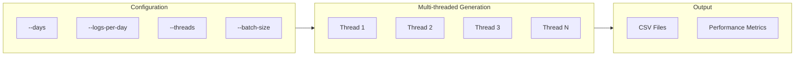
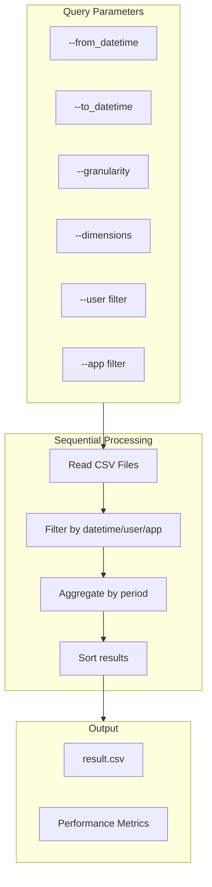
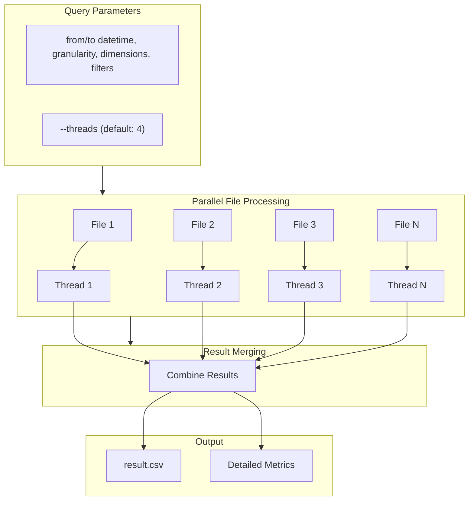
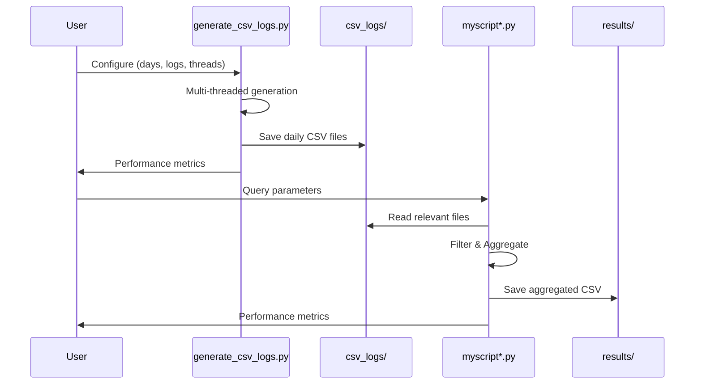
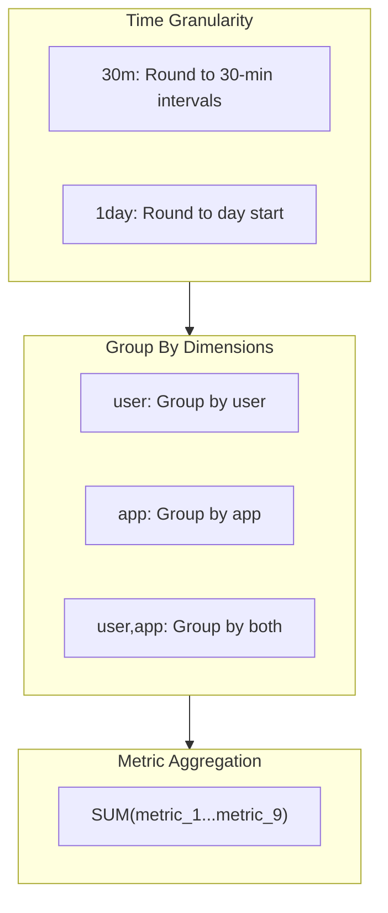

# Python Log Aggregation Pipeline

A high-performance log aggregation system that generates, processes, and analyzes CSV log files with multi-threading support.

## 📊 Architecture Overview

```mermaid
flowchart TB
    subgraph Generation["📝 Log Generation"]
        GEN[generate_csv_logs.py]
        GEN --> |"Multi-threaded"| CSV1[2025-01-01.log.csv]
        GEN --> CSV2[2025-01-02.log.csv]
        GEN --> CSV3[...]
        GEN --> CSVN[2025-03-31.log.csv]
    end
    
    subgraph Storage["💾 CSV Storage"]
        CSV1 --> LOGS[(csv_logs/)]
        CSV2 --> LOGS
        CSV3 --> LOGS
        CSVN --> LOGS
    end
    
    subgraph Processing["⚡ Query Processing"]
        LOGS --> |"Single-threaded"| BASIC[myscript.py]
        LOGS --> |"Multi-threaded"| OPT[myscript_optimized.py]
    end
    
    subgraph Output["📈 Results"]
        BASIC --> RESULT[(results/)]
        OPT --> RESULT
    end
```



## 📁 Project Structure

```
python/
├── generate_csv_logs.py    # Generate sample CSV log files
├── myscript.py             # Basic log aggregation (single-threaded)
├── myscript_optimized.py   # Optimized aggregation (multi-threaded)
├── csv_logs/               # Generated log files
│   ├── 2025-01-01.log.csv
│   ├── 2025-01-02.log.csv
│   └── ...
├── results/                # Query output files
│   ├── result.csv
│   ├── result_1.csv
│   └── ...
└── README.md
```

## 🔧 Components

### 1. Log Generator (`generate_csv_logs.py`)

Generates sample CSV log files with configurable parameters.



#### Usage

```bash
# Default: 90 days, 50k logs/day, 4 threads
python generate_csv_logs.py

# Custom configuration
python generate_csv_logs.py --days=30 --logs-per-day=100000 --threads=8

# Full options
python generate_csv_logs.py \
    --days=90 \
    --logs-per-day=50000 \
    --threads=4 \
    --batch-size=10000 \
    --start-date=2025-01-01 \
    --output-dir=./csv_logs
```

#### Options

| Option | Description | Default |
|--------|-------------|---------|
| `--days` | Number of days to generate | 90 |
| `--logs-per-day` | Logs per day | 50,000 |
| `--threads` | Worker threads | 4 |
| `--batch-size` | Logs per batch | 10,000 |
| `--start-date` | Start date (YYYY-MM-DD) | 2025-01-01 |
| `--output-dir` | Output directory | ./csv_logs |

---

### 2. Basic Aggregator (`myscript.py`)

Single-threaded log aggregation for smaller datasets.



#### Usage

```bash
# Basic query
python myscript.py \
    --from_datetime="2025-01-01 00:00:00" \
    --to_datetime="2025-01-31 23:59:59" \
    --granularity=1day \
    --dimensions=user

# With filters
python myscript.py \
    --from_datetime="2025-01-01 00:00:00" \
    --to_datetime="2025-01-31 23:59:59" \
    --granularity=30m \
    --dimensions=user,app \
    --user=user1,user2 \
    --app=facebook,twitter
```

---

### 3. Optimized Aggregator (`myscript_optimized.py`)

Multi-threaded aggregation for **millions of records**.



#### Usage

```bash
# Query with 4 threads (default)
python myscript_optimized.py \
    --from_datetime="2025-01-01 00:00:00" \
    --to_datetime="2025-03-31 23:59:59" \
    --granularity=1day \
    --dimensions=user

# Query with 8 threads for maximum performance
python myscript_optimized.py \
    --from_datetime="2025-01-01 00:00:00" \
    --to_datetime="2025-03-31 23:59:59" \
    --granularity=30m \
    --dimensions=user,app \
    --threads=8
```

---

## 📋 CSV Log Format

Each log file contains the following columns:

| Column | Description | Example |
|--------|-------------|---------|
| timestamp | Log timestamp | 2025-01-01 14:30:45 |
| user | User identifier | user42 |
| app | Application name | facebook |
| metric_1 - metric_9 | Numeric metrics | 123, 456, ... |

### Sample Data

```csv
2025-01-01 00:15:23,user42,facebook,234,567,123,890,456,789,321,654,987
2025-01-01 00:22:45,user17,twitter,345,678,234,901,567,890,432,765,098
```

---

## ⚡ Performance Comparison

| Metric | myscript.py | myscript_optimized.py |
|--------|-------------|----------------------|
| Processing | Single-threaded | Multi-threaded |
| Best for | < 100K records | Millions of records |
| Speed (90 days, 50K/day) | ~12s | ~5s |
| Memory | ~12 MB | ~14 MB |
| CPU Utilization | ~100% (1 core) | ~15-30% (distributed) |

---

## 📊 Data Flow Diagram



---

## 🎯 Aggregation Logic



### Examples

| Query | Groups By | Result |
|-------|-----------|--------|
| `--granularity=30m --dimensions=user` | 30-min period + user | Sum of metrics per user per 30 mins |
| `--granularity=1day --dimensions=app` | Day + app | Sum of metrics per app per day |
| `--granularity=1day --dimensions=user,app` | Day + user + app | Sum per user-app pair per day |

---

## 🔍 Performance Metrics

Both query scripts display detailed performance metrics:

```
======================================================================
SYSTEM INFORMATION
======================================================================
  CPU Model:      Intel(R) Core(TM) i5-8250U CPU @ 1.60GHz
  CPU Cores:      8
  CPU Frequency:  2900 MHz (2.90 GHz)
  Total Memory:   11.6 GB
======================================================================

PERFORMANCE METRICS
======================================================================
Phase                                  Time        Rows/sec
----------------------------------------------------------------------
Data reading & aggregation           5.286s        2,521
Writing results                      1.02ms
----------------------------------------------------------------------
TOTAL                                5.287s
======================================================================

CPU METRICS
----------------------------------------------------------------------
  CPU Cores Used:      4 / 8 available
  CPU Frequency:       3400 MHz
  CPU Usage (read):    15.3%
  CPU Usage (total):   15.3%

MEMORY & I/O
----------------------------------------------------------------------
  Peak Memory:         14.00 MB
  I/O Read Ops:        0
  I/O Write Ops:       40
======================================================================
```

---

## 🚀 Quick Start

```bash
# 1. Generate sample logs (5 days, 50K logs each)
python generate_csv_logs.py --days=5 --logs-per-day=50000

# 2. Query with basic script
python myscript.py \
    --from_datetime="2025-01-01 00:00:00" \
    --to_datetime="2025-01-05 23:59:59" \
    --granularity=1day \
    --dimensions=user

# 3. Query with optimized script (for large datasets)
python myscript_optimized.py \
    --from_datetime="2025-01-01 00:00:00" \
    --to_datetime="2025-01-05 23:59:59" \
    --granularity=1day \
    --dimensions=user \
    --threads=4
```

---

## 📝 License

This project is for educational purposes - Data Pipelines Exercise.
