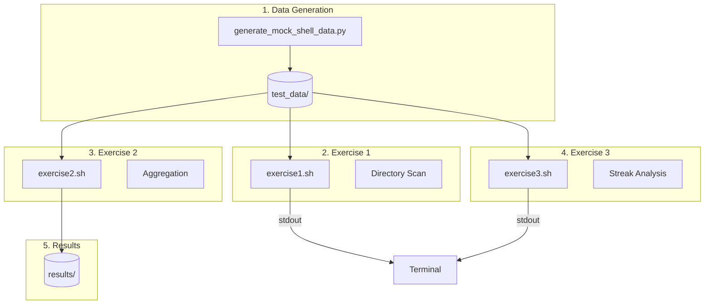

# Shell Script Exercises

Solutions for directory analysis, log aggregation, and user streak usage exercises.

## 📊 Flow Diagram



## 📁 Structure

```
shell_script/
├── generate_mock_shell_data.py    # Generates test data
├── exercise1.sh                   # Dir size check (>1GB using .git)
├── exercise2.sh                   # CSV Join/Aggregation
├── exercise3.sh                   # User daily streak check
├── test_data/                     # Generated mock data
└── results/                       # Outputs for Exercise 2
```

## 🚀 How to Run

**1. Initialize Data**
```bash
python3 shell_script/generate_mock_shell_data.py
```

**2. Run Exercise 1 (Directory Size)**
```bash
# Finds folders >1GB with .git
chmod +x shell_script/exercise1.sh
./shell_script/exercise1.sh shell_script/test_data/ex1
```

**3. Run Exercise 2 (Log Aggregation)**
```bash
# Aggregates Users per App/Device
chmod +x shell_script/exercise2.sh
./shell_script/exercise2.sh 2020-01-16
```

**4. Run Exercise 3 (Streak Analysis)**
```bash
# Users who used app1 every day until Jan 22
chmod +x shell_script/exercise3.sh
./shell_script/exercise3.sh 2020-01-22 app1
```

---

## 💻 Terminal Output

### Exercise 1 Output
```
Scanning shell_script/test_data/ex1...
-----------------------------------
Found: shell_script/test_data/ex1/repo2
Size: 1101 MB
Time taken: 4 ms
-----------------------------------
```

### Exercise 2 Output
```
Processing data for 2020-01-16...
Created shell_script/results/apps_users.csv
Created shell_script/results/devices_users.csv
Created shell_script/results/apps_devices.csv
```

### Exercise 3 Output
```
Users using app1 every day up to 2020-01-22:
user1
user2
```
